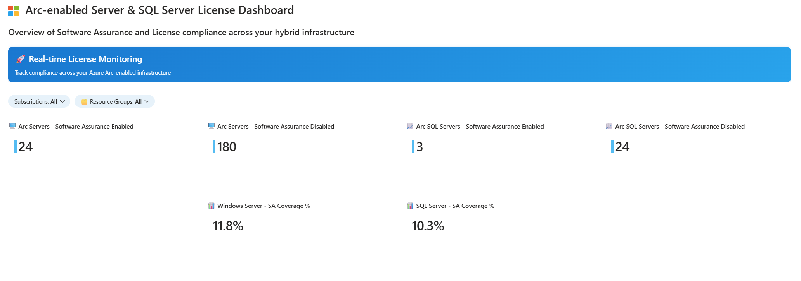

# Azure Arc Software Assurance Dashboard

A comprehensive Azure Workbook for monitoring Software Assurance compliance across your hybrid infrastructure with Arc-enabled servers and SQL Server instances.

## Overview

This workbook provides real-time visibility into your Azure Arc-enabled infrastructure licensing status, helping you:

- Track Software Assurance compliance across Windows Servers
- Identify potential licensing gaps
- Generate compliance reports for hybrid infrastructure

## Screenshots




*The dashboard provides a comprehensive view of your Arc-enabled infrastructure with licensing compliance metrics and detailed server inventory.*

## Features

### 📊 Key Metrics Dashboard
- **Software Assurance Enabled/Disabled** Windows & SQL servers count
- **Coverage Percentages** - Real-time SA compliance rates for Windows and SQL Server

### 📋 Detailed Server Inventory
- Complete list of Arc-enabled servers and SQL instances
- Multi-level filtering:
  - **Subscription** selection (single or multiple)
  - **Resource Group** filtering with resource counts
  - **Server Type** filtering (Windows Server, SQL Server)
  - **Version-specific** filtering (Windows Server versions, SQL Server versions)
- Sortable by various attributes

## Prerequisites

- Azure subscription with Arc-enabled servers
- Azure Monitor Workbooks access
- Appropriate RBAC permissions to view hybrid compute resources

## Installation

1. **Clone this repository:**
   ```bash
   git clone https://github.com/claestom/azure-arc-sa-workbook.git
   ```

2. **Import the workbook:**
   - Navigate to Azure Monitor > Workbooks in the Azure portal
   - Click "New" and select "Advanced Editor"
   - Copy the contents of `workbooks/arc-sa-overview.json`
   - Paste into the Gallery Template editor
   - Click "Apply" and save the workbook

3. **Configure parameters:**
   - Select your subscription(s) from the dropdown
   - Choose specific resource group(s) or select "All"
   - Use server type filters to focus on Windows or SQL Server instances
   - Apply version-specific filters for granular analysis

## Azure Resource Graph Queries

For users who prefer to run individual queries directly in Azure Resource Graph, this repository also includes standalone KQL queries in the `arg/` folder:

- **`arcSAsummary.kql`** - Summary metrics for Software Assurance compliance
- **`arcSAdetailed.kql`** - Detailed server inventory with licensing information

These queries can be executed directly in:
- [Azure Resource Graph Explorer](https://portal.azure.com/#view/HubsExtension/ArgQueryBlade) in the Azure portal
- Azure CLI using `az graph query`
- Azure PowerShell using `Search-AzGraph`
- REST API calls to Azure Resource Graph

## Contributing

1. Fork the repository
2. Create a feature branch (`git checkout -b feature/enhancement`)
3. Commit your changes (`git commit -am 'Add new feature'`)
4. Push to the branch (`git push origin feature/enhancement`)
5. Create a Pull Request

## License

This project is licensed under the MIT License - see the [LICENSE](LICENSE) file for details.

## Disclaimer

This workbook is provided as-is for monitoring purposes. Always consult with your licensing team and review Microsoft licensing terms for official compliance requirements.

---
